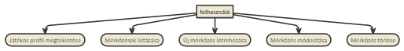
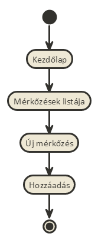
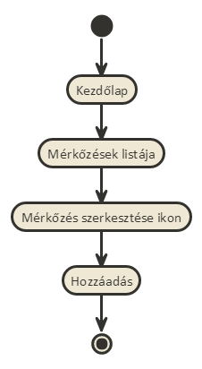
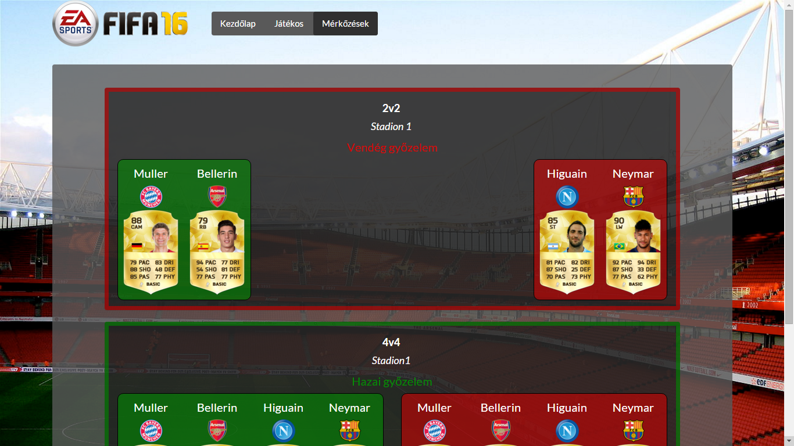
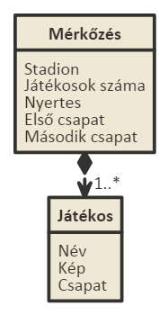
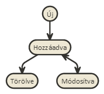

# Fifa 16 Ultimate Team meccsek

## Követelményanalízis

### Funkcionális elvárások
**A programnak tartalmaznia kell:**

•	legalább két modellt, egy-sok kapcsolatban

•	legalább 1 űrlapot

•	legalább 1 listázó oldalt

•	legyen lehetőség új felvételére

•	legyen lehetőség meglévő szerkesztésére

•	legyen lehetőség meglévő törlésére

### Nem funkcionális követelmények
•	REST API végpont kialakítása

•	szerveroldali perzisztálás fájlba

### Szerepkörök
•	Felhasználó: Láthatja a játékos profilját, valamint a mérkőzések listáját, ahol újakat csinálhat, valamint meglévőket törölhet és módosíthat.

### Használatieset-modell

### Új mérkőzés hozzáadása

### Mérkőzés módosítása

## Tervezés

### Architektúra terv

Oldaltérkép

  Publikus:
  
  •	Kezdőlap
  
  •	Játékos
  
  •	Mérkőzések
  
    +	új mérkőzés
    
    +	mérkőzés módosítása
    
    +	mérkőzés törlése

Végpontok

•	GET /: főoldal

•	GET /profile: Játékos profilja

• GET /history: mérkőzések története részletes adatokkal

•	GET /new-match: új mérkőzés létrehozásának oldala

•	GET /edit-match{id}: mérkőzés módosítása

### Felhasználói felület:

### Osztálymodell
  Adatmodell
    
  Állapotdiagram
    

## Implementáció

### Fejlesztői környezet:
Az alkalmazást a Cloud 9 online fejlesztői környezetében készült.

### Könyvtárstruktúrában lévő mappák
•	docs/images: A dokumentációhoz szükséges képeket tartalmazza

•	app/models: A match és a player egyedek modelljeit tartalmazza

•	app/controllers: A mérkőzésekhez szükséges műveletek fájljait tartalmazza

•	app/adapters: Az api-val való összekötéshez szükséges fájlt tartalmazza

•	app/routes: A végpontokhoz szükséges fájlokat tartalmazza

•	app/styles: A desig kialakításáért felelős fájlt tartalmazza

•	app/templates: Az oldal megjelenítéséért felelő fájlokat tartalmazza

•	app/templates/components: Az oldal megjelenítéséért felelő kisebb, ismétlődő részeit tartalmazza

•	node_modules: A programhoz szükséges telepített elemeket tartalmazza

•	public/assets/images: Az oldal felépítéséhez használt képeket tartalmazza

•	test: Teszteseketek tartalmazza

## Tesztelés

A tesztesetek a "test" mappában lévő "create.test.js" fájlban találhatóak.
Ez demonstrálja, hogy egy felhasználó a regisztráció után:

•	visszanyerhető-e minden adat és ezek megegyeznek-e a regisztrációnál megadottakkal.

•	az adatbázisban bármikor megtalálhatóak és visszanyerhetőek-e a letárolt adatok

•	rossz adatoknál hibát dob-e az oldal

•	jó jelszó megadása esetén enged-e belépni az oldal

•	rossz jelszó megadása esetén hibát jelez-e az oldal

## Felhasználói dokumentáció
### Menü
•	"Fifa 16 logo" : Ide kattintva a Kezdőlapra navigálunk át.

•	"Kezdőlap" : Ide kattintva szintén a Kezdőlapra navigálunk át.

•	"Játékos" : Ide kattintva láthatjuk a játékos profilját a részletes adatokkal.

•	"Mérkőzések" : Ide kattintva navigálunk át a mérkőzések listáját tartalmazó oldalra.

### Mérkőzések
Itt jelennek meg a mérkőzések az alábbi adataikkal:

•	Játékosok száma

•	Stadion

•   Mérkőzés kimenetele

•	A két csapat játékosonként felsorolva

Az oldalon a mérkőzéseket tartalmazó dobozok kerete a nyertes csapat színében pompázik.
A lista alján található új mérkőzés ikonnal vehetünk fel új mérkőzést a listánkhoz.
Minden mérkőzést a saját módosító ikonjával módosíthatunk.
Minden mérkőzést a saját törlő ikonjával törölhetünk.
